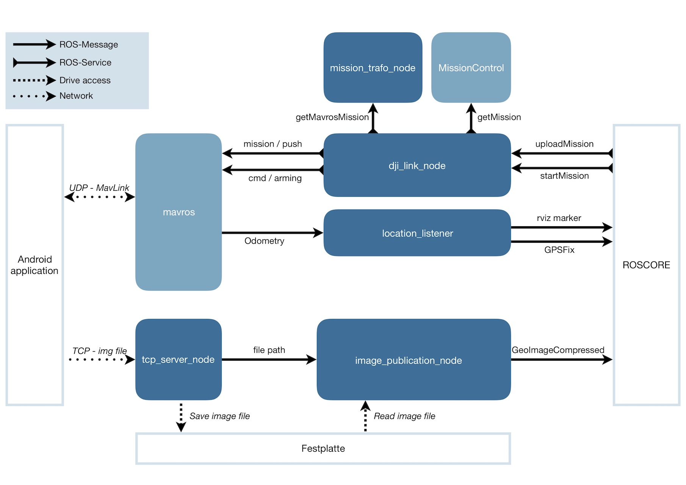

# ROS:DJILink
The DJILink project allows to control a DJI-drone from ROS. It uses the "DJI Mobile SDK" in an Android-application and connects to ROS with the MAVLink-protocol. It also allows to receive aerial images from the drone while still in flight.

---
## Requirements
The Android device and your ROS-System have to be part of the same network. UDP- and TCP-connections have to be allowed.

This ROS-package needs the MAVROS-package to be installed on your system to communicate via the MAVLink-protocol. The mission itself has to be created elsewhere.

In this project, a closed-source ROS-package named "MissionControl" was used, which holds an externally created mission and offers a service called "GetMission". To use it with a different package, you have to change the called service in "dji_link_node.py" and adjust the transformation algorithm in "missionTrafo.py" to fit your mission-type.

---

## Concept

---

## Connections

### UDP-Connection
Used to transmit the following data via MAVLink:

* mission
* start command
* position of the UAV
* attitude of the UAV

### TCP-Connection
Used to transmit the aerial images with a self-defined protocol.